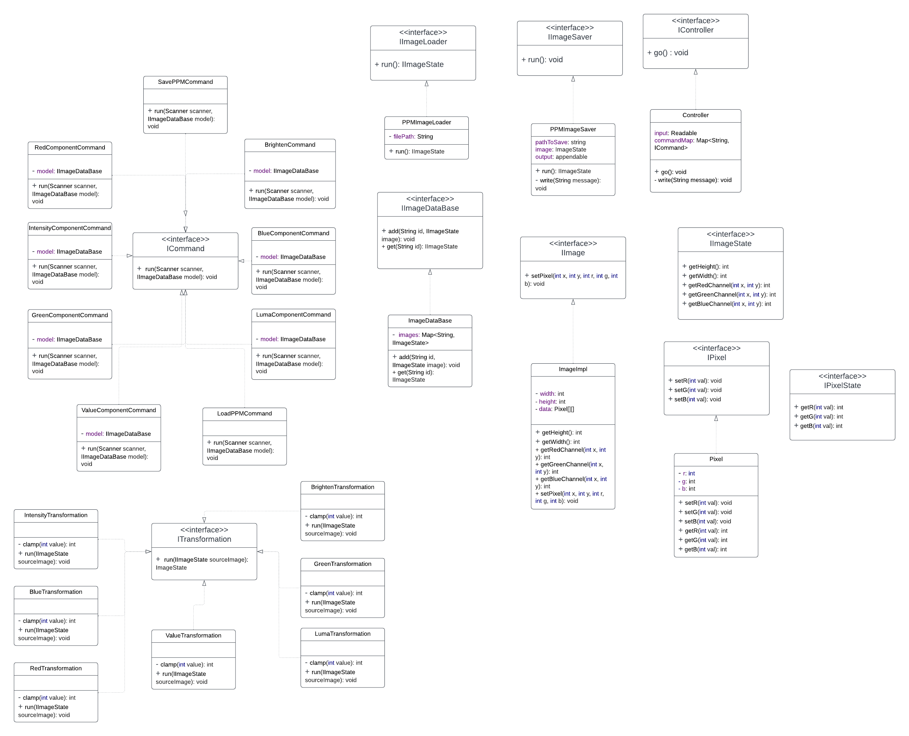

part 1: an explanation of the design

we are dividing the program into three parts: model,view and controller.
For this assignment, we focus on the model and controller part. Here is 
a breakdown of the class design:
The model package includes another package called the transformations, 
which has an interface called ITransformation. All the transformation classes
implements this interface. It does the real action of manipulating an image,
including blue,red and green color transformations, the greyscale transformation
and the brighten or darken transformation. All these classes serve as the helper functions
for the commands in teh controller package.
Under the model package we also have five more interfaces:
IPixel and IPixelState are interfaces for setting individual pixels and getting
pixel information.
IImage and IImageState are interfaces for creating images and getting
image information.
The ImageDataBase class implements the IImageDataBase and stores images in a map.
The ImageImpl class implements the IImage interface and creates images using
PPM files.
For the controller package, we've got an IO package that include the helper functions.
It has two interfaces: the IImageLoader and IImageSaver, for loading and saving
the images. These two interfaces, implemented by PPMImageLoader and PPMImageSaver,
serves as helper functions for the Load command and the save command.
The controller package obviously has an IController interface, implemented by the controller
class, which gets input from the user and pass it to the model for processing.
Under the command package, we have got an ICommand interface, implemented by 9 
different commands. We used the strategy pattern for the operations in this assignment.
Each command does one thing required by the assignment.
Last but not least, we have a Main class for testing the program.

part 2: available commands for the program.

load res/red.ppm red
save res/red-brighter.ppm red-brighter
brighten 10 red red-brighter
value-component red red-greyscale
luma-component red red-greyscale
intensity-component red red-greyscale
red-component red red-red
blue-component red red-blue
green-component red red-green

part 3: source of the image
I used the paint.s on mac to draw a 3*4 image, saved it as png,
then I converted it from png to ppm, using https://convertio.co/download/c37c660bc4c2272946b3845836771fb47c703e/
The converter converts it to the p6 PPM, so I used another converter to 
convert the image from p6 to p3, using https://thomasebsmith.github.io/ppm-converter/

part 4: class diagram
